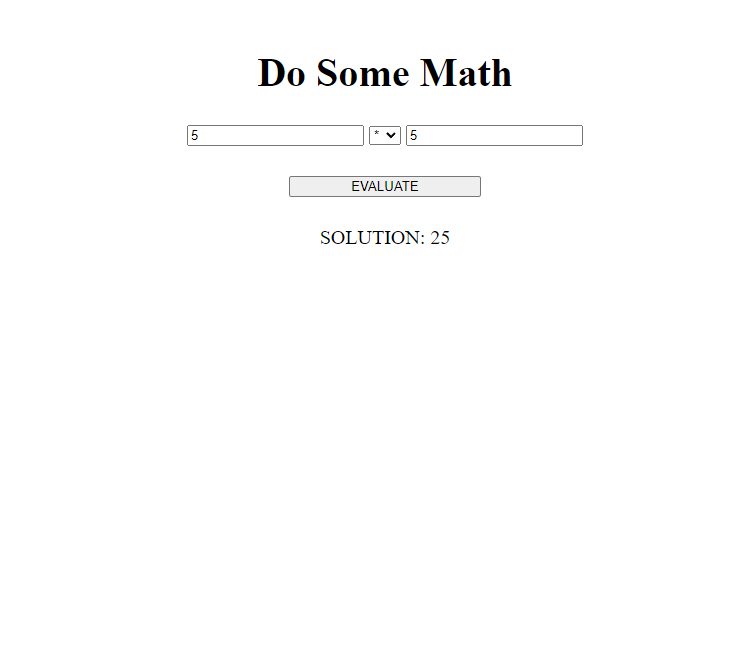

Aidan Diaz Calculator App
HTML5, CSS3, Javascript - very basic calculator app that takes in two user inputs and returns the result of an equation, using the selected operator

 

Link to site: https://verybasiccalculatorapp.netlify.app/

How It's Made:

Tech used: HTML5, CSS3, JavaScript

My learning was focused on ensuring that user inputs would be converted to numbers and that the solution to the equation is displayed on the DOM

Optimizations

I updated my JavaScript to make sure that the input would be converted to a number AFTER checking to see if there was an input. If the input was an empty string and immediately passed into the number constructor, the number constructor would convert its value to 0 rather than prompting the user to enter an input.

Lessons Learned:

It's important to ensure that you store the value of an input inside of your function, rather than in global scope - storing it in global scope would mean that the user would never have an opportunity to enter a value, as the empty value would be stored on page load in global scope.